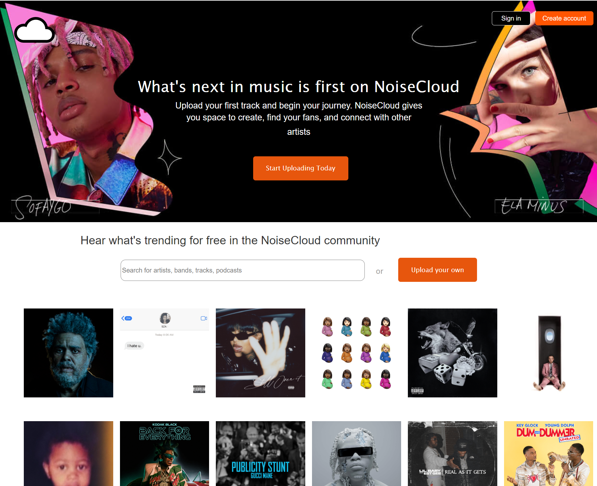
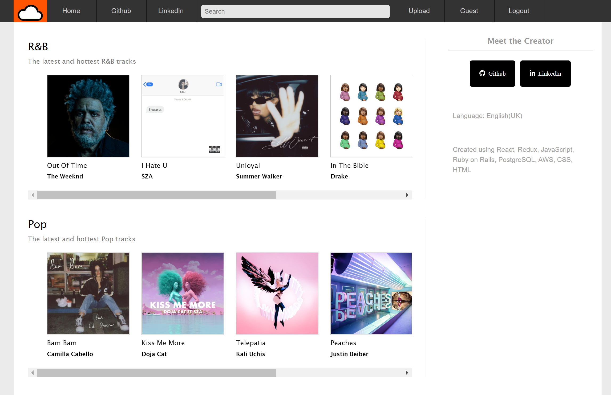
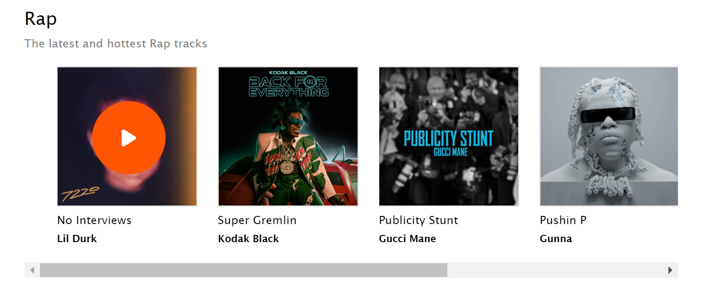
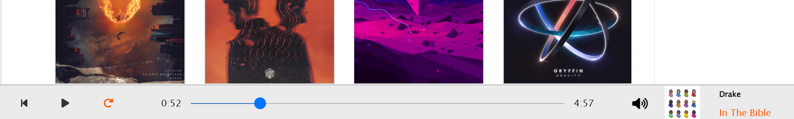
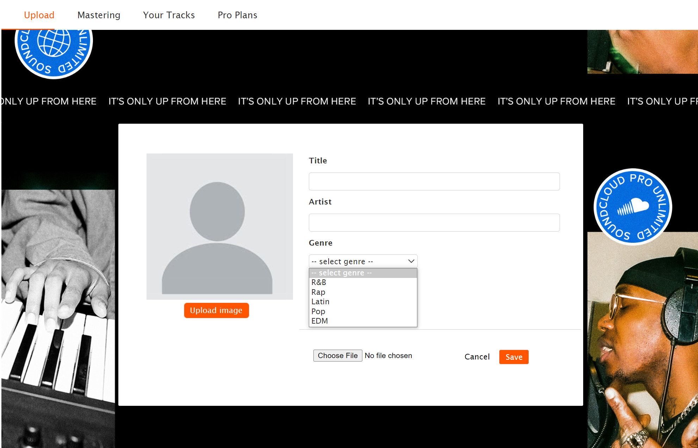
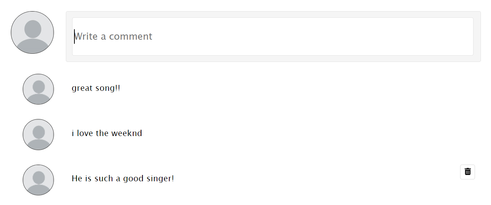

# NoiseCloud

[noisecloud Live on Heroku](https://noisecloud.herokuapp.com/#/)

NoiseCloud is a full-stack clone of the popular music-streaming platform SoundCloud, where users can stream music and upload their own music content to the web

</img>

# Technologies Used

* Backend 
  * PostgreSQL
  * Ruby on Rails
  * AJAX
  * Jbuilder
* Frontend
  * React
  * Redux
  * HTML5
  * CSS
* Hosting
  * Amazon AWS S3
  * Heroku

# Features

## User Authentication

Users can create a personal account by filling in the form which is rendered after clicking the 'Signup' button. There is also the option to use a demo login to view the site. Errors are rendered if the correct criteria is not met.

</img>

## Discover Page

Upon successful login, users will be redirected to the discover page, where they can view a list of trending tracks across 5 popular music genres. 

</img>

## Play Button

Once at the discover page, a play button is rendered whenever the user hovers over a track's image. Once clicked, this button will initiate the music player. This play button component is seen throughout the site, and changes it's state depending on the track's play status. This is done by passing 2 props into the play button's container file: the track's information and a boolean to determine whether or not the track is currently playing.

```javascript
// frontend/components/play_button/play_button_container.jsx
const mapStateToProps = state => ({
    currentTrack: state.ui.trackPlaybar.currentTrack,
    isPlaying: state.ui.trackPlaybar.isPlaying,
});

const mapDispatchToProps = dispatch => ({
    receivePlayTrack: track => dispatch(receivePlayTrack(track)),
    removePlayTrack: () => dispatch(removePlayTrack()), 
    playTrack: () => dispatch(playTrack()),
    pauseTrack: () => dispatch(pauseTrack())
});

```

</img>

## Continuous Audio Play

Once the play button is pressed, the music player is rendered along the bottom of the screen. Users can pause the track, restart the track, set the track on a continuous loop, adjust volume, and view the length and duration of the track. Users can navigate throughout the site and the bar will remain on the bottom of the screen, playing the music without any interruption. This is done by rendering the TrackPlaybar component in a protected route and by persisting the current track's play status in a state nested under the ui state

```javascript
//frontend/components/app.jsx
<ProtectedRoute path="/" component={TrackPlaybarContainer}/>
```
```javascript
// frontend/components/track_playbar/track_playbar_container.jsx
const mapStateToProps = state => ({
    currentTrack: state.ui.trackPlaybar.currentTrack,
    isPlaying: state.ui.trackPlaybar.isPlaying,
});

const mapDispatchToProps = dispatch => ({
    receivePlayTrack: track => dispatch(receivePlayTrack(track)),
    removePlayTrack: () => dispatch(removePlayTrack()), 
    playTrack: () => dispatch(playTrack()),
    pauseTrack: () => dispatch(pauseTrack())
});

```

</img>

## Uploading Tracks

Users can upload tracks to NoiseCloud, provided a title, artist, and genre. Much like SoundCloud, if an image is not provided, their profile photo will be assigned to the track. The track will then be listed on that user's profile page.

</img>

## Creating Comments

Users can interact with one another by entering comments into the coment box on any track page. Users can delete any of their comments if they choose to.

</img>

## Future Features
* Following between users
* Liking tracks 
* Playlist creation